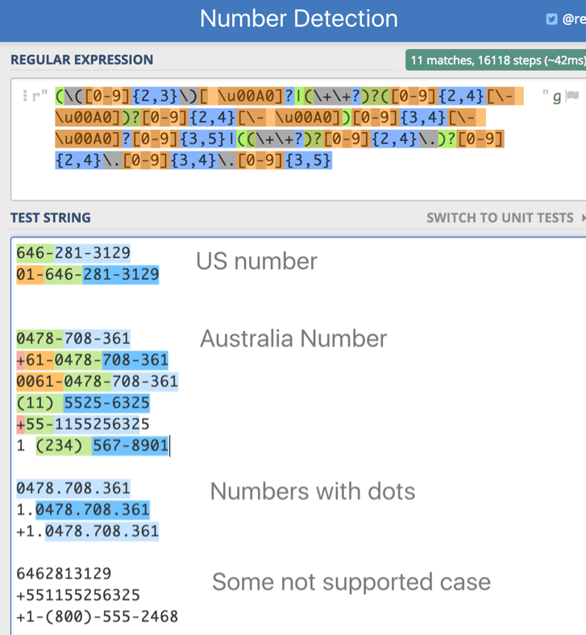
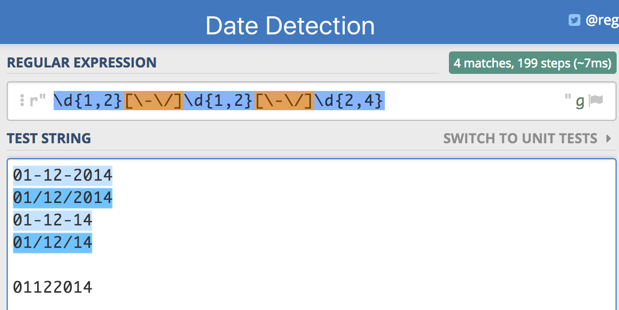
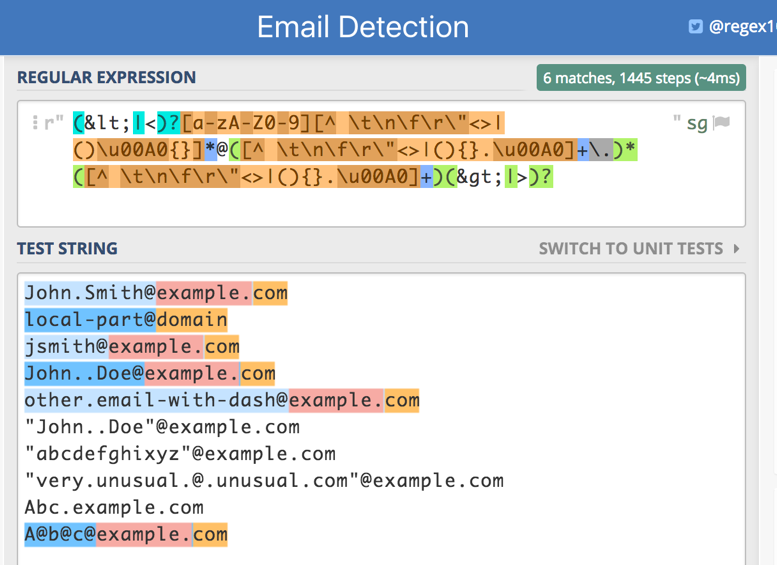
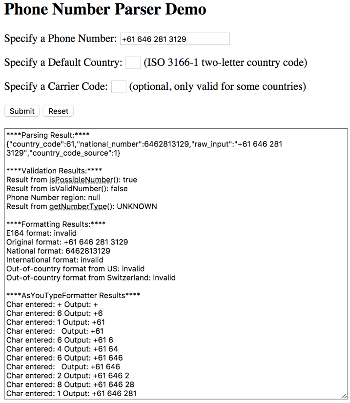

# Pattern Recognition

Table of contents:

1. Pattern recognition using regular expression
2.	Pattern recognition using open source libraries
3.	Pattern recognition using third party tools 


## Regular expression 

The following regular expression is provided by Stanford NLP Tokenizer, the original files provides various pattern recognition regular expression, here we only presented some regular expression that would be most useful for us. The detail can be found in this [link](https://github.com/stanfordnlp/CoreNLP/blob/master/src/edu/stanford/nlp/process/PTBLexer.flex).

~~~
EMAIL = (&lt;|<)?[a-zA-Z0-9][^ \t\n\f\r\"<>|()\u00A0{}]*@([^ \t\n\f\r\"<>|(){}.\u00A0]+\.)*([^ \t\n\f\r\"<>|(){}.\u00A0]+)(&gt;|>)?

PHONE = (\([0-9]{2,3}\)[ \u00A0]?|(\+\+?)?([0-9]{2,4}[\- \u00A0])?[0-9]{2,4}[\- \u00A0])[0-9]{3,4}[\- \u00A0]?[0-9]{3,5}|((\+\+?)?[0-9]{2,4}\.)?[0-9]{2,4}\.[0-9]{3,4}\.[0-9]{3,5}

DATE = \d{1,2}[\-\/]\d{1,2}[\-\/]\d{2,4}

FULLURL = https?:\/\/[^ \t\n\f\r\"<>|(){}]+[^ \t\n\f\r\"<>|.!?(){},-]

LIKELYURL = ((www\.([^ \t\n\f\r\"<>|.!?(){},]+\.)+[a-zA-Z]{2,4})|(([^ \t\n\f\r\"`'<>|.!?(){},-_$]+\.)+(com|net|org|edu)))(\/[^ \t\n\f\r\"<>|()]+[^ \t\n\f\r\"<>|.!?(){},-])?

ABMONTH = Jan|Feb|Mar|Apr|Jun|Jul|Aug|Sep|Sept|Oct|Nov|Dec
ABDAYS = Mon|Tue|Tues|Wed|Thu|Thurs|Fri
ABSTATE = Ala|Ariz|[A]z|[A]rk|Calif|Colo|Conn|Ct|Dak|[D]el|Fla|Ga|[I]ll|Ind|Kans?|Ky|[L]a|[M]ass|Md|Mich|Minn|[M]iss|Mo|Mont|Neb|Nev|Okla|[O]re|[P]a|Penn|Tenn|[T]ex|Va|Vt|[W]ash|Wisc?|Wyo
~~~

Some Demo Result of using regular expression:





As we can see from the demo, the phone number detection is not performing well due to the different structure used by different regions in the world. 

Thus in next section, we will introduce some more sophisticated library for phone number detection.  


##	Open source libraries for Phone Number
We explored one library for phone number detection, we will explore more library for date detection, address detection in the future.

### Google libphonenumber

Google's provides Java, C++ and JavaScript library for parsing, formatting, and validating international phone numbers.  https://github.com/googlei18n/libphonenumber
This library can validate phone number, extract country code and national number, reformat the number, etc. A [quick example](https://github.com/googlei18n/libphonenumber#quick-examples). A [JavaScript Demo](https://rawgit.com/googlei18n/libphonenumber/master/javascript/i18n/phonenumbers/demo-compiled.html)


There are several third-party ports of the phone number library supporting various languages:

*   C#: https://github.com/aidanbebbington/libphonenumber-csharp
*   PHP: https://github.com/giggsey/libphonenumber-for-php
*   Python: https://github.com/daviddrysdale/python-phonenumbers
*   Ruby: https://github.com/sstephenson/global_phone
*   javascript (stripped-down version): https://github.com/halt-hammerzeit/libphonenumber-js
*   objective-c: https://github.com/iziz/libPhoneNumber-iOS


You can try it with your own number. For example, the demo output looks like this:





##	Paid third party software

Generally, open source libraries already provide satisfying functionality for daily uses. But if more advanced functionality is required, we’ve found some third party software to provide more sophisticated functionalities. 

### Twilio
For example, [Twilio](https://www.twilio.com/lookup) can be used for number detection. It support functionality such as:

- Find Caller Name: Get the Caller ID Name (CNAM) for a phone number
- Identify carrier: Know which carrier is connected to a user's number
- Check type: Determine if a number is a landline, VoIP, or mobile

---

# Mobile Customer Data
For field in the mobile customer data, we can use Regular expression to detect some fieds:

#### "State"

For matching state abbreviation

```
Ala|Ariz|[A]z|[A]rk|Calif|Colo|Conn|Ct|Dak|[D]el|Fla|Ga|[I]ll|Ind|Kans?|Ky|[L]a|[M]ass|Md|Mich|Minn|[M]iss|Mo|Mont|Neb|Nev|Okla|[O]re|[P]a|Penn|Tenn|[T]ex|Va|Vt|[W]ash|Wisc?|Wyo
```

#### "Zip"

```
^[0-9]{5}(?:-[0-9]{4})?$
```

#### "CellPhone" : 
Below is an example regexp, we can also use other regxp if perform better.
```
(\([0-9]{2,3}\)[ \u00A0]?|(\+\+?)?([0-9]{2,4}[\- \u00A0])?[0-9]{2,4}[\- \u00A0])[0-9]{3,4}[\- \u00A0]?[0-9]{3,5}|((\+\+?)?[0-9]{2,4}\.)?[0-9]{2,4}\.[0-9]{3,4}\.[0-9]{3,5}
```

#### "Phone"
is the format different than cell phone?

#### "DOB"

```
\d{1,2}[\####\/]\d{1,2}[\####\/]\d{2,4}
```
If contains alphabets

1. Contains (month name or short names such as September, Sept, Sep)

Else

1. Split by / or –
2. Check if splits are numeric of length 2,2, 4 or 2,2,2, or 1,1,2 or 1,1,4. 

For first 2 fields, range must be within 1####30 for one and 1####12 for other
