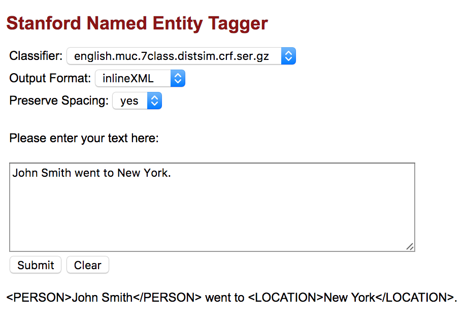

# Pattern Recognition

Our goal is to: 

- Design high level data processing pipeline for pattern recognition
- Design different workflow to accommodate different business requirement

Currently we are working on how to identify the category of any random given column. We will discuss the following types: **Name, Location, Phone Number, DOB, SSN#, Credit card number **


# Simple workflow

The actual implementation of pattern recognition depends on the data type of the incoming data. For example, the incoming data could be `Data Stream`, `JSON`, `CSV`, `Fixed Width Text File `. The procedure of handling different files can be very different. 

Here, we only provide a simple pattern recognition work flow for identifying the pattern of a single data cell. 

```
Input: String data

if alphabetic:
	match Person Name
    match Location
    default unknowfield
else:
    match Email
	match DOB
	match Phone Number
	match Credit Card Number
	match SSN
	match Zipcode
	defalt unknowfield
```

The data format might be inconsisten, in this case, we can determine the data type of by majorities. 


## Name/Location Detection

For name detection, we have two approach to deal with this problem.

1. Download public data for name matching. Example of free public name data: [5,000 First names CSV](https://www.sajari.com/free-data/CSV_Database_of_First_Names.csv), [80,000 Last names CSV](https://www.sajari.com/free-data/CSV_Database_of_Last_Names.csv) from [Sajari](https://www.sajari.com/public-data).

2. Use free software for name matching. One commonly used software is [Standford Named Entity Recognizer](https://nlp.stanford.edu/software/CRF-NER.shtml). Below is a screenshot of [online demo](http://nlp.stanford.edu:8080/ner/process):

   

   ​

   Using the tools above, we will be able to guess whether a column is name or location.

   ​

## Phone Number

```
PHONE = \s*(?:\+?(\d{1,3}))?[-. (]*(\d{3})[-. )]*(\d{3})[-. ]*(\d{4})(?: *x(\d+))?\s*
```

Details can be found at this another report [here](https://github.com/hexiaoyuhaha/PatternRecognition/blob/master/PhoneNumber_Date.md): 

Some business rules could be:

- Detect country code and area code (Use the phone number country code and area code to find out the distribution of customer)
- Allow parenthesis () in the phone number


## DOB Detection

```
DATE = \d{1,2}[\-\/]\d{1,2}[\-\/]\d{2,4}
```


## SSN

The Social Security number is a nine-digit number in the format "AAA-GG-SSSS" [1](https://en.wikipedia.org/wiki/Social_Security_number#Structure). Some special numbers are never allocated [2](https://en.wikipedia.org/wiki/Social_Security_number#Valid_SSNs):

- Numbers with all zeros in any digit group (*000*-##-####, ###-*00*-####, ###-##-*0000*).]
- Numbers with 666 or 900-999 ([Individual Taxpayer Identification Number](https://en.wikipedia.org/wiki/Individual_Taxpayer_Identification_Number)) in the first digit group.]

#### Regular Expression

Below is an regular expression for matching and validating a SSN number. [3](https://www.codeproject.com/Articles/651609/Validating-Social-Security-Numbers-through-Regular)

```
^                                       #Start of expression
(?!\b(\d)\1+-(\d)\1+-(\d)\1+\b)         #Don't allow all matching digits for every field
(?!123-45-6789|219-09-9999|078-05-1120) #Don't allow "123-45-6789", "219-09-9999" or "078-05-1120"
(?!666|000|9\d{2})\d{3}                 #Don't allow the SSN to begin with 666, 000 or anything between 900-999
-                                       #A dash (separating Area and Group numbers)
(?!00)\d{2}                             #Don't allow the Group Number to be "00"
-                                       #Another dash (separating Group and Serial numbers)
(?!0{4})\d{4}                           #Don't allow last four digits to be "0000"
$                                       #End of expression
```

This regular expression can be easily alterd to acommondate different bussiness requirement. Some example businees requirement could be:

- Allow SSN like `AAAGGGSSSS` with no dash
- Report fraudulent or invalid SSN
- Report missing digits in SSN


#### Software

Two Official verification tools from US government are:

1. The [Social Security Number Verification Service](http://www.ssa.gov/employer/ssnv.htm) - This **free** online service allows users to verify that the names and SSN of hired employees match Social Security’s records.
2. The [Consent Based Social Security Number Verification Service](http://www.ssa.gov/cbsv/) - This **fee-based** Social Security number verification service is available to enrolled private companies, state and local government agencies to provide instant automated verification and can handle large volume requests.

There are also numerous free open source tools online. 


## Credit card number

There is a [online resource](http://www.regular-expressions.info/creditcard.html) that provides a regular expression for matching credit card number.

A most simple matching regular expression is:

```
# Please remove all the space and dash before matcing the regular expression.
(?:\d[ -]*?){13,16}
```

This regular expression can be easily alterd to acommondate different bussiness requirement. Some example businees requirement could be:

- Detect kinds of credit card. We can use the below regular expression:

```
^(?:4[0-9]{12}(?:[0-9]{3})?          # Visa
 |  (?:5[1-5][0-9]{2}                # MasterCard
     | 222[1-9]|22[3-9][0-9]|2[3-6][0-9]{2}|27[01][0-9]|2720)[0-9]{12}
 |  3[47][0-9]{13}                   # American Express
 |  3(?:0[0-5]|[68][0-9])[0-9]{11}   # Diners Club
 |  6(?:011|5[0-9]{2})[0-9]{12}      # Discover
 |  (?:2131|1800|35\d{3})\d{11}      # JCB
)$
```


## Zipcode

The following regexp matches ZIP code (U.S.), allowing 5-digit and 9-digit formats. The regex matches `12345` and `12345-6789`, but not `1234`, `123456`, `123456789`, or `1234-56789`.

```^[0-9]{5}(?:-[0-9]{4})?$```

Example businees requirement could be:

- Only allow 4-digit or 9-digit zipcode matching
- 9-digit zipcode must have dash seperating them


# Appendix

```
EMAIL = [a-zA-Z0-9_.+-]+@[a-zA-Z0-9-]+\.[a-zA-Z0-9-.]+
PHONE = \s*(?:\+?(\d{1,3}))?[-. (]*(\d{3})[-. )]*(\d{3})[-. ]*(\d{4})(?: *x(\d+))?\s*
DATE = \d{1,2}[\-\/]\d{1,2}[\-\/]\d{2,4}
CRE = (?:\d[ -]*?){13,16}
SSN = (?!\b(\d)\1+-(\d)\1+-(\d)\1+\b)(?!123-45-6789|219-09-9999|078-05-1120)(?!666|000|9\d{2})\d{3}-(?!00)\d{2}-(?!0{4})\d{4}
ZIP = [0-9]{5}(?:-[0-9]{4})?


DATE = {DIGIT}{1,2}[\-\/]{DIGIT}{1,2}[\-\/]{DIGIT}{2,4}
FILENAME = ({LETTER}|{DIGIT})+([-._/]({LETTER}|{DIGIT})+)*([.]{FILENAME_EXT})
ISO8601DATETIME = [0-9]{4}-[0-9]{2}-[0-9]{2}T[0-9]{2}:[x0-9]{2}:[0-9]{2}Z?
FULLURL = https?:\/\/[^ \t\n\f\r\"<>|(){}]+[^ \t\n\f\r\"<>|.!?(){},-]
LIKELYURL = ((www\.([^ \t\n\f\r\"<>|.!?(){},]+\.)+[a-zA-Z]{2,4})|(([^ \t\n\f\r\"`'<>|.!?(){},-_$]+\.)+(com|net|org|edu)))(\/[^ \t\n\f\r\"<>|()]+[^ \t\n\f\r\"<>|.!?(){},-])?
ABMONTH = Jan|Feb|Mar|Apr|Jun|Jul|Aug|Sep|Sept|Oct|Nov|Dec
ABDAYS = Mon|Tue|Tues|Wed|Thu|Thurs|Fri
ABSTATE = Ala|Ariz|[A]z|[A]rk|Calif|Colo|Conn|Ct|Dak|[D]el|Fla|Ga|[I]ll|Ind|Kans?|Ky|[L]a|[M]ass|Md|Mich|Minn|[M]iss|Mo|Mont|Neb|Nev|Okla|[O]re|[P]a|Penn|Tenn|[T]ex|Va|Vt|[W]ash|Wisc?|Wyo

```

